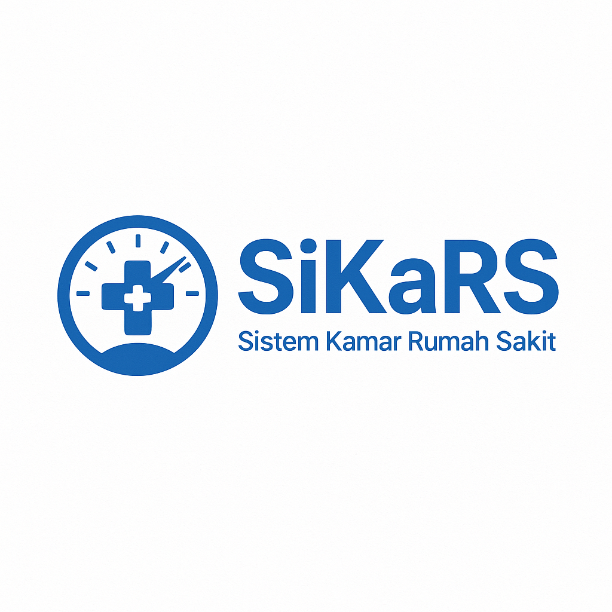

# 🏨 SiKaRS – Sistem Kamar Rumah Sakit

**SiKaRS** adalah aplikasi Flutter yang fokus pada manajemen pemesanan dan pengelolaan kamar rumah sakit, cocok untuk kebutuhan administrasi dan operasional rumah sakit.

## ✨ Fitur
- 👥 Login multi-role (Admin, Staff)
- 🛏️ CRUD data kamar
- 📆 Booking kamar untuk pasien
- 📌 Riwayat penggunaan kamar

## ⚙️ Teknologi
- Flutter
- Firebase Firestore
- Firebase Authentication (opsional)
- Desain UI responsif & user-friendly

## 📂 Struktur Folder
SiKaRS/
┣ lib/
┃ ┣ models/
┃ ┣ pages/
┃ ┣ providers/
┃ ┣ services/
┃ ┗ main.dart
┣ assets/
┗ pubspec.yaml

yaml
Salin
Edit

## 🔧 Setup Awal
1. Hubungkan proyek ke Firebase (Firestore + Auth jika digunakan).
2. Jalankan `flutter pub get`.
3. Jalankan aplikasi dengan `flutter run`.

## 👤 Kontributor
- [@muhamadzikriramadhan](https://github.com/muhamadzikriramadhan)

---